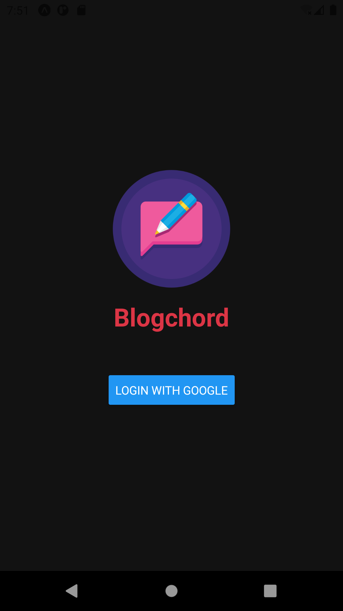

# Blogchord-App

> A blogging platform designed for little stories that make your day better.  
> Built using MERnN Stack.

### Features

1. Post/Edit your blogs
2. Set private or public status for your blogs
3. User Profile Visit
4. Save posts(Bookmark)
5. Likes
6. Alerts & Toast Messages(in app)

### Screenshots

<h6>
#1 Login Screen | #2 Home Screen | #3 #4 Dashboard Screen | #5 Read Blog Screen | #6 User Profile | #7 Post Screen | #8 Edit Screen
</h6>

